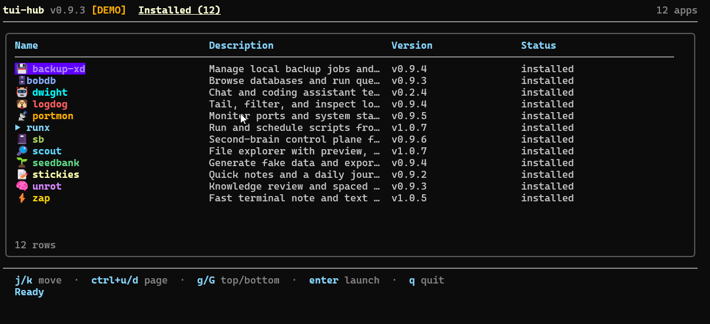

# tui-hub

Launcher for the `tui-suite` app collection. `tui-hub` keeps the default view focused on what you already have installed, while the second page handles discovery, install, and update flow for the rest of the suite.



**Live demo:** [froesch.dev](https://froesch.dev)

## Install

Supported platforms: Linux, macOS, and Windows.

Recommended:

```bash
curl -fsSL https://raw.githubusercontent.com/LFroesch/tui-hub/main/install.sh | bash
```

Other options:

```bash
go install github.com/LFroesch/tui-hub@latest
make install
```

Windows:

```powershell
./install.ps1
```

```bat
install.cmd
```

Run:

```bash
tui-hub
tui-hub --version
```

## Pages

| Page | Purpose |
|------|---------|
| Installed | Launch apps already on your `PATH`, sorted alphabetically |
| Available | Browse curated suite apps that are not installed yet |

Install and update actions call each app's own `install.sh` release installer.

## Projects In This Suite

| App | Description | In `tui-hub` catalog |
|-----|-------------|----------------------|
| [backup-xd](https://github.com/LFroesch/backup-xd) | Backup manager for database dumps, file copies, and restores. | Yes |
| [bobdb](https://github.com/LFroesch/bobdb) | Database browser and query runner for SQLite, Postgres, and MongoDB. | Yes |
| [dwight](https://github.com/LFroesch/dwight) | Terminal AI chat client for Ollama, Gemini, and local file context. | Yes |
| [logdog](https://github.com/LFroesch/logdog) | Log discovery, tailing, filtering, and terminal inspection. | Yes |
| [portmon](https://github.com/LFroesch/portmon) | Live port monitor with process ownership and lightweight system stats. | Yes |
| [runx](https://github.com/LFroesch/runx) | Saved script runner with schedules, prompts, and live output. | Yes |
| [sb](https://github.com/LFroesch/sb) | `WORK.md` control plane for cleanup, dumps, and agent-backed runs. | Yes |
| [scout](https://github.com/LFroesch/scout) | File explorer with preview, search, bookmarks, and shell-friendly navigation. | Yes |
| [seedbank](https://github.com/LFroesch/seedbank) | Fake-data generator for fixtures, demos, and seed scripts. | Yes |
| [stickies](https://github.com/LFroesch/stickies) | Quick notes and daily journaling with a small pipe-friendly CLI. | Yes |
| [unrot](https://github.com/LFroesch/unrot) | Knowledge review and spaced-repetition study app for your own notes. | Yes |
| [zap](https://github.com/LFroesch/zap) | Personal file registry for fast preview, reopen, and editing. | Yes |

`chunes` is out of the current `tui-hub` v1 scope.

## Controls

| Key | Action |
|-----|--------|
| `tab`, `shift+tab`, `1`, `2` | Switch pages |
| `j/k`, `up/down` | Move |
| `enter` | Launch selected installed app |
| `i` | Install selected available app |
| `u` | Update selected installed app |
| `r` | Refresh release info for installed apps |
| `g`, `G` | Jump to top or bottom |
| `?` | Help |
| `q` | Quit |

## Config

Config is stored at `~/.config/tui-hub/config.json`.

It only keeps user state:

- last active page
- per-app launch count
- per-app launch history metadata

The catalog itself is built into the app.

## Notes

- version checks are manual; `tui-hub` does not call GitHub on startup
- local builds with a `-dirty` suffix are treated as the matching release version for update checks
- games are out of scope for the current launcher

## License

[AGPL-3.0](LICENSE)
